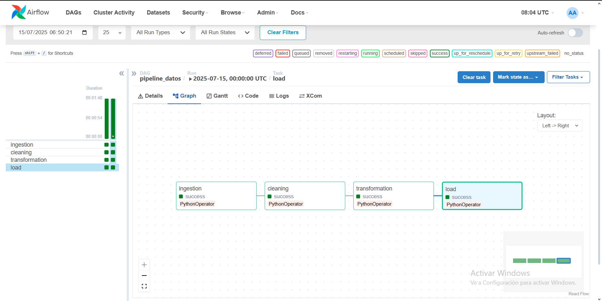
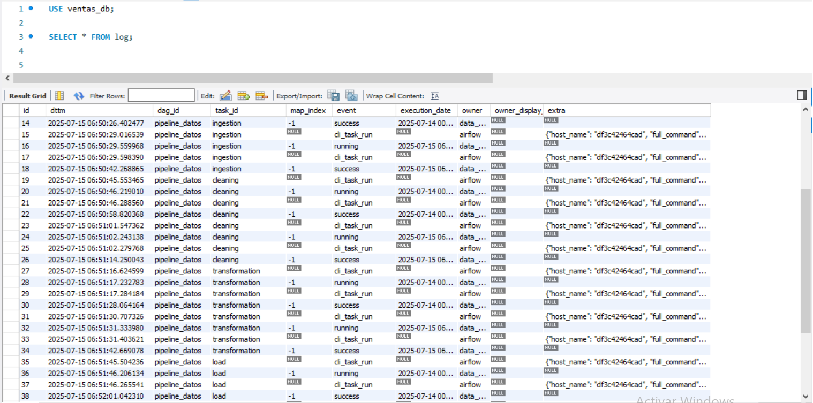

# 🧪 Proyecto: Pipeline de Datos Escalable y Confiable

## 🎯 Objetivo

Diseñar un pipeline ETL usando Spark y Airflow para procesar datos de ventas diarias desde archivos CSV, aplicando limpieza, transformación y carga final en una base de datos relacional.

---

## 🌐 Repositorio del Proyecto

Este proyecto está alojado en GitHub:

> 🔗 https://github.com/JohnRamirez23/t_r_transaction_pao

---

## ⚙️ Tecnologías Usadas

- **Apache Airflow**: Orquestación del pipeline.
- **Apache Spark (PySpark)**: Procesamiento de datos batch.
- **MySQL**: Base de datos simulada (contenedor).
- **Docker & Docker Compose**: Entorno reproducible.
- **Python 3.10**: Scripts de procesamiento.

---

## 📂 Estructura del Proyecto

```
t_r_transaction_pao/
├── dags/
├── scripts/
├── data/
├── docker/
├── evidencia_ejecucion/
├── requirements.txt
└── README.md
```

---

## 🚀 Cómo Ejecutar el Proyecto

### 1. Clona este repositorio

```bash
git clone https://github.com/JohnRamirez23/t_r_transaction_pao.git
cd t_r_transaction_pao/docker
```

### 2. Levantar el entorno con Docker

```bash
docker-compose up --build airflow-webserver airflow-scheduler
```

> 💡 Alternativamente:

```bash
docker-compose up --build
docker-compose up -d airflow-scheduler
```

### 3. Abrir Airflow

- URL: [http://localhost:8081](http://localhost:8081)
- Usuario: `admin`
- Contraseña: `admin`

---

## 📈 Descripción del Pipeline

| Etapa | Descripción |
|-------|-------------|
| **Ingesta** | Lee el archivo `Ventas_diarias.csv` usando Spark y lo guarda como Parquet. |
| **Limpieza** | Elimina valores nulos, corrige formatos de fecha y columnas inconsistentes. |
| **Transformación** | Suma ventas por día usando `groupBy` y `sum`. |
| **Carga** | Simula la carga en una base de datos relacional (MySQL contenedor). |

---

## 📊 Resultados de Ejecución

- **Registros ingeridos:** Dependen del archivo CSV (`Ventas_diarias.csv`)
- **Registros luego de limpieza:** Filtrados por datos nulos o inconsistentes
- **Registros transformados:** Totales de ventas por día
- **Logs:** Visibles en Airflow y almacenados en MySQL

---

## 📷 Evidencia de Ejecución

### DAG ejecutado en Airflow

La siguiente imagen muestra el DAG `pipeline_datos` orquestado correctamente, con todas las tareas completadas con éxito (`success`):



### Logs desde MySQL

También se incluye una captura de los registros de ejecución guardados en la base de datos `ventas_db` (tabla `log`), que muestran las tareas realizadas por Airflow:



---

## 📦 Nota sobre archivos generados automáticamente

Este repositorio omite ciertos archivos como:

- Archivos `.parquet` intermedios generados por el pipeline
- Carpetas `__pycache__/` de Python
- Directorios `.idea/` del entorno de desarrollo

Estos archivos se regeneran automáticamente al ejecutar el DAG `pipeline_datos`, comenzando desde el archivo fuente `Ventas_diarias.csv`.  
Esto mantiene el repositorio limpio, portable y alineado con buenas prácticas de desarrollo.
